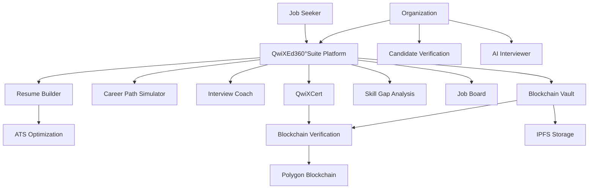

  
  # QwiXEd360°Suite
  ### AI-Powered Career Development Platform
  
  
  
  
  
  
  **🏆 Powered by QwikZen Group India**

## 🚀 About QwiXEd360°Suite

QwiXEd360°Suite is an intelligent career development platform that leverages AI and blockchain technology to transform how job seekers prepare for, secure, and advance in their careers. Our platform addresses critical challenges faced by modern job seekers through innovative tools designed to provide measurable competitive advantages.

## 🔍 Problem Statements & Our Solutions

| Problem | Solution |
|---------|----------|
| **ATS Rejection** | AI-powered resume optimization with real-time scoring against job descriptions |
| **Credential Verification** | Blockchain-secured certificates that are immutable and instantly verifiable |
| **Skill Gap Identification** | Personalized analysis and learning path recommendations |
| **Interview Preparation** | AI interview coach with performance feedback and industry-specific questions |
| **Career Path Uncertainty** | Visual career trajectory mapping with skill development roadmaps |
| **Document Security** | Blockchain-based document vault with tamper-proof verification |
| **Professional Portfolio** | Dynamic showcase platform for projects and credentials |

## 🌟 Key Features for Job Seekers

### CV Tools: Craft Your Professional Image
Our suite of CV and profile optimization tools designed to help you stand out in the job market with AI-powered assistance.

- **Resume Builder** - Create ATS-optimized resumes with AI guidance
  - AI-powered content suggestions
  - Section-by-section guidance
  - Multiple professional templates

- **ATS Scanner** - Optimize your resume for job applications
  - Real-time resume scoring
  - Keyword optimization
  - Side-by-side comparison with job descriptions

- **LinkedIn Optimizer** - Enhance your LinkedIn profile visibility
  - Profile optimization analysis
  - Keyword recommendation engine
  - Content suggestion for engagement

- **Resume Compare** - Compare multiple resume versions
  - Side-by-side visual comparison
  - Impact analysis
  - Industry benchmark against peers

### QwiX Career Guide: Navigate Your Professional Journey
Tools to help you plan, visualize, and optimize your career path with AI-driven insights and practical guidance.

- **Career Path Simulator** - Visualize your future career trajectory
  - Career growth visualization
  - Skill development roadmaps
  - Personalized advancement strategies

- **Interview Coach** - Prepare for job interviews with AI
  - Practice with AI interviewer
  - Industry-specific question sets
  - Performance feedback and analysis

- **Job Board** - Find opportunities matched to your profile
  - Resume-matched job recommendations
  - Application tracking system
  - Direct employer connections

- **AI Job Switch Planner** - Plan your career transition effectively
  - Switch feasibility calculation
  - Learning paths identification
  - Transition timeline planning

- **AI Shadow Career Simulator** - Experience different career paths virtually
  - Day-in-the-life simulations
  - Career challenge scenarios
  - Skill compatibility assessment

- **AI Layoff Readiness Toolkit** - Prepare for career uncertainties
  - Job stability assessment
  - Emergency career planning
  - Market transferable skills identification

### QwiX Learn: Upskill with Intelligence
Advanced learning tools that analyze your skill gaps and provide tailored learning paths to keep you competitive in your field.

- **AI Coding Coach** - Improve your coding skills with AI guidance
  - Real-time code feedback
  - Algorithm optimization tips
  - Interview preparation exercises

- **QwiXPro Builder** - Create professional portfolios
  - Dynamic project showcases
  - Integrated GitHub projects
  - Customizable design options

- **Skill Gap Analysis** - Identify and bridge your skill gaps
  - Current vs. required skills mapping
  - Personalized learning recommendations
  - Progress tracking dashboard

- **Mindprint Assessment** - Discover your ideal career path
  - Cognitive ability assessment
  - Personal values alignment
  - Career compatibility recommendations

### Blockchain Security: Protect Your Professional Identity
Leverage the power of blockchain to secure and verify your professional credentials and documents with tamper-proof technology.

- **QwiXCert** - Blockchain-verified certifications
  - Tamper-proof certification storage
  - Verifiable credentials for employers
  - Certification assessment exams

- **Blockchain Vault** - Secure document storage using blockchain
  - Tamper-proof document storage
  - Universal verification system
  - Decentralized security protocol

## 💼 Key Features for Organizations

- **Candidate Verification** - Instantly verify blockchain-secured credentials and certificates
- **AI Interviewer** - Conduct preliminary interviews to screen candidates
- **Resume Parser** - Efficiently extract and analyze candidate information
- **Aptitude Exams** - Create and administer blockchain-verified skill assessments
- **Document Generator** - Create branded certificates and company documents
- **Blockchain Verification** - Issue and verify credentials on the blockchain
- **Application Tracking** - Manage and evaluate candidate applications

## 💻 Technology Stack

  <table>
    <tr>
      <td align="center" width="96">
        
         React 18.3.1
      </td>
      <td align="center" width="96">
        
         TypeScript
      </td>
      <td align="center" width="96">
        
         Tailwind CSS
      </td>
      <td align="center" width="96">
        
         Vite
      </td>
      <td align="center" width="96">
        
         Three.js
      </td>
    </tr>
    <tr>
      <td align="center" width="96">
        
         React Router 7
      </td>
      <td align="center" width="96">
        
         Radix UI
      </td>
      <td align="center" width="96">
        
         shadcn/ui
      </td>
      <td align="center" width="96">
        
         Framer Motion
      </td>
      <td align="center" width="96">
        
         React Query
      </td>
    </tr>
    <tr>
      <td align="center" width="96">
        
         Ethers.js
      </td>
      <td align="center" width="96">
        
         MetaMask SDK
      </td>
      <td align="center" width="96">
        
         NFT.Storage
      </td>
      <td align="center" width="96">
        
         Recharts
      </td>
      <td align="center" width="96">
        
         React-ChartJS-2
      </td>
    </tr>
    <tr>
      <td align="center" width="96">
        
         React Hook Form
      </td>
      <td align="center" width="96">
        
         Zod
      </td>
      <td align="center" width="96">
        
         Supabase
      </td>
      <td align="center" width="96">
        
         Polygon
      </td>
      <td align="center" width="96">
        
         Gemini AI
      </td>
    </tr>
  </table>

### Complete Technology Stack

#### Frontend Core
- **React 18.3.1** - JavaScript library for building user interfaces
- **TypeScript** - Strongly typed programming language (built on JavaScript)
- **Vite** - Build tool and development server
- **Tailwind CSS 3.x** - Utility-first CSS framework
- **React Router DOM 7.6.0** - Routing library for React

#### UI Component Libraries
- **shadcn/ui** - Component library built on Radix UI
- **Radix UI** (various components, versions 1.1.x-2.2.x) - Unstyled, accessible UI primitives
- **Lucide React 0.508.0** - Icon library
- **Framer Motion 12.10.1** - Animation library
- **cmdk 1.0.0** - Command palette component
- **Vaul 0.9.3** - Drawer components
- **Sonner 1.5.0** - Toast notification system
- **Embla Carousel React 8.3.0** - Carousel components
- **class-variance-authority 0.7.1** - Class name utility
- **tailwind-merge 2.5.2** - Tailwind class merging utility
- **tailwindcss-animate 1.0.7** - Animation utilities for Tailwind CSS
- **clsx 2.1.1** - Class name construction utility

#### Form Management
- **React Hook Form 7.53.0** - Form state management
- **@hookform/resolvers 3.9.0** - Form validation resolvers
- **Zod 3.23.8** - Schema validation library
- **input-otp 1.2.4** - One-time password input component

#### Data Management & API Integration
- **TanStack React Query 5.56.2** - Data fetching and state management
- **Fetch API** - Browser API for making HTTP requests
- **Arbeitnow API** - Job board API for job listings
- **RapidAPI Services**:
  - AI Resume Parser Extractor
  - Open AI Text-to-Speech
  - Speech-to-Text AI
  - Facial AI Analyzer
  - AI Grammar Checker

#### AI & Machine Learning
- **Google Gemini API** - AI text generation and analysis
- **Hugging Face Transformers** - AI transformers for text processing
- **AI transformer models**:
  - Text generation models
  - Text classification models
  - Feature extraction models

#### Blockchain Technology
- **Ethers.js 6.9.2** - Ethereum blockchain interaction library
- **MetaMask SDK React 0.14.2** - Wallet integration
- **NFT.storage 7.2.0** - IPFS integration for decentralized storage
- **Blockchain networks**:
  - Ethereum Mainnet
  - Goerli Testnet
  - Polygon Mainnet
  - Polygon Mumbai Testnet
  - QwixChain (custom blockchain implementation)

#### Document Processing
- **html2pdf.js 0.10.1** - HTML to PDF conversion
- **jsPDF 2.5.1** - PDF generation library
- **html2canvas 1.4.1** - HTML to canvas conversion
- **QRCode 1.5.4** - QR code generation library
- **QRCode.react 3.1.0** - React component for QR codes

#### Data Visualization
- **Recharts 2.12.7** - Chart library for React
- **Three.js 0.133.1** - 3D visualization library
- **React-ChartJS-2 5.3.0** - React wrapper for Chart.js

#### Date & Time Handling
- **date-fns 4.1.0** - Date manipulation library
- **React Day Picker 8.10.1** - Date picker component

#### Authentication & Backend
- **Supabase Client 2.49.4** - Backend-as-a-service client
- **Supabase Authentication** - User authentication service
- **Supabase Database** - PostgreSQL database service
- **Supabase Storage** - File storage service

#### Utilities
- **UUID 9.0.1** - Unique identifier generation
- **js-sha256 0.11.0** - SHA-256 hashing algorithm implementation
- **esbuild 0.25.0** - JavaScript bundler used by Vite
- **next-themes 0.3.0** - Theme management utility

#### UI Panels & Layout
- **react-resizable-panels 2.1.3** - Resizable panel components

#### Security & Identity
- **QwixMask** (custom implementation) - Blockchain wallet and identity service
- **MetaMask integration** - External wallet service connection

#### Custom Project Elements
- **QwiXCert** - Blockchain certification system
- **QwiX Career Guide** - Career planning tools
- **QwiX Learn** - Learning and skill development system
- **QwixVault** - Blockchain document storage system

#### Development Tools
- **ESLint** - Code quality tool
- **TypeScript compiler** - Static type checking
- **Vite dev server** - Development environment

## 🔄 Platform Architecture

## 📱 Platform Overview

QwiXEd360°Suite provides a comprehensive ecosystem of tools designed to address the complexities of modern career development. By combining AI-powered optimization with blockchain verification, we're creating a new standard for professional credentialing and career advancement.

Our platform not only helps job seekers create better resumes and prepare for interviews but also provides organizations with tools to verify credentials and streamline their hiring processes. The blockchain integration ensures all certifications and documents are tamper-proof and instantly verifiable, bringing trust and efficiency to the hiring process.

## 👨‍💼 Designed and Developed By

  
  <h3>Dhadi Sai Praneeth Reddy</h3>
  
<strong>Founder & CTO, QwikZen Group India</strong>

  
  

    
    
    
  

  
📱 +91 7416466619 | 📧 dspraneeth07@gmail.com

## 🔗 Connect with QwikZen Group India

  
  
  
  

## 📄 License

Copyright © 2024 QwikZen Group India. All Rights Reserved.
