  
  # QwiXEd360°Suite
  ### AI-Powered Career Development Platform
  
  
  
  
  
  
  **🏆 Powered by QwikZen Group India**

## 🚀 About QwiXEd360°Suite

QwiXEd360°Suite is an intelligent career development platform that leverages AI and blockchain technology to transform how job seekers prepare for, secure, and advance in their careers. Our platform addresses critical challenges faced by modern job seekers through innovative tools designed to provide measurable competitive advantages.

## 🔍 Problem Statements & Our Solutions

| Problem | Solution |
|---------|----------|
| **ATS Rejection** | AI-powered resume optimization with real-time scoring against job descriptions |
| **Credential Verification** | Blockchain-secured certificates that are immutable and instantly verifiable |
| **Skill Gap Identification** | Personalized analysis and learning path recommendations |
| **Interview Preparation** | AI interview coach with performance feedback and industry-specific questions |
| **Career Path Uncertainty** | Visual career trajectory mapping with skill development roadmaps |
| **Document Security** | Blockchain-based document vault with tamper-proof verification |
| **Professional Portfolio** | Dynamic showcase platform for projects and credentials |

## 🌟 Key Features for Job Seekers

- **AI-Powered Resume Generation** - Smart content suggestions with section-by-section guidance
- **ATS Optimization** - Real-time scoring against job descriptions with improvement recommendations
- **Resume Comparison** - Side-by-side visualization with job requirements
- **Blockchain Certifications** - Verifiable credentials secured on blockchain
- **Career Path Simulator** - Visualize potential career trajectories and skill development paths
- **Job Board & Matching** - Personalized job recommendations based on your resume
- **Interview Coach** - AI-powered interview practice with real-time feedback
- **Skill Gap Analysis** - Identify needed skills for target positions
- **QwiXPro Builder** - Create professional portfolios and project showcases
- **Blockchain Document Vault** - Secure storage with tamper-proof verification

## 💼 Key Features for Organizations

- **Candidate Verification** - Instantly verify blockchain-secured credentials and certificates
- **AI Interviewer** - Conduct preliminary interviews to screen candidates
- **Resume Parser** - Efficiently extract and analyze candidate information
- **Aptitude Exams** - Create and administer blockchain-verified skill assessments
- **Document Generator** - Create branded certificates and company documents
- **Blockchain Verification** - Issue and verify credentials on the blockchain
- **Application Tracking** - Manage and evaluate candidate applications

## 💻 Technology Stack

  <table>
    <tr>
      <td align="center" width="96">
        
         React 18
      </td>
      <td align="center" width="96">
        
         TypeScript
      </td>
      <td align="center" width="96">
        
         Tailwind CSS
      </td>
      <td align="center" width="96">
        
         Three.js
      </td>
      <td align="center" width="96">
        
         Ethereum
      </td>
    </tr>
    <tr>
      <td align="center" width="96">
        
         Vite
      </td>
      <td align="center" width="96">
        
         React Query
      </td>
      <td align="center" width="96">
        
         Recharts
      </td>
      <td align="center" width="96">
        
         Radix UI
      </td>
      <td align="center" width="96">
        
         shadcn/ui
      </td>
    </tr>
    <tr>
      <td align="center" width="96">
        
         Supabase
      </td>
      <td align="center" width="96">
        
         Framer Motion
      </td>
      <td align="center" width="96">
        
         Polygon
      </td>
      <td align="center" width="96">
        
         Gemini AI
      </td>
      <td align="center" width="96">
        
         IPFS/NFT.Storage
      </td>
    </tr>
  </table>

### Frontend Framework & UI
- **React 18** with **TypeScript** for type-safe components
- **Vite** for fast development and optimized production builds
- **Tailwind CSS** for utility-first styling
- **shadcn/ui** components built with Radix UI primitives
- **Lucide Icons** for consistent UI iconography
- **Three.js** for interactive 3D visualizations
- **Framer Motion** for fluid animations and transitions

### State Management & Data Handling
- **TanStack Query** (React Query) for data fetching & caching
- **React Hook Form** with **Zod** validation
- **Context API** and **Zustand** for state management
- **html2pdf.js** and **jsPDF** for document generation

### Blockchain Integration
- **Ethers.js** for Ethereum wallet implementation
- **IPFS/NFT.Storage** for decentralized storage of certificates
- **Polygon** for fast, low-cost transactions

### AI & Machine Learning
- **Google Gemini API** for natural language processing
- **Hugging Face Transformers** for text analysis and generation
- **Custom AI models** for resume optimization and interview coaching

## 🔄 Platform Architecture

```mermaid
graph TD
    A[Job Seeker] --> B[QwiXEd360°Suite Platform]
    B --> C[Resume Builder]
    B --> D[Career Path Simulator]
    B --> E[Interview Coach]
    B --> F[Blockchain Vault]
    B --> G[Skill Gap Analysis]
    B --> H[Job Board]
    B --> I[QwiXCert]
    
    J[Organization] --> B
    J --> K[Candidate Verification]
    J --> L[AI Interviewer]
    
    C --> M[ATS Optimization]
    I --> N[Blockchain Verification]
    F --> N
    
    N --> O[Polygon Blockchain]
    F --> P[IPFS Storage]
```

## 📱 Platform Overview

QwiXEd360°Suite provides a comprehensive ecosystem of tools designed to address the complexities of modern career development. By combining AI-powered optimization with blockchain verification, we're creating a new standard for professional credentialing and career advancement.

Our platform not only helps job seekers create better resumes and prepare for interviews but also provides organizations with tools to verify credentials and streamline their hiring processes. The blockchain integration ensures all certifications and documents are tamper-proof and instantly verifiable, bringing trust and efficiency to the hiring process.

## 👨‍💼 Designed and Developed By

  
  <h3>Dhadi Sai Praneeth Reddy</h3>
  
<strong>Founder & CTO, QwikZen Group India</strong>

  
  

    
    
    
  

  
📱 +91 7416466619 | 📧 dspraneeth07@gmail.com

## 🔗 Connect with QwikZen Group India

  
  
  

## 📄 License

Copyright © 2024 QwikZen Group India. All Rights Reserved.

